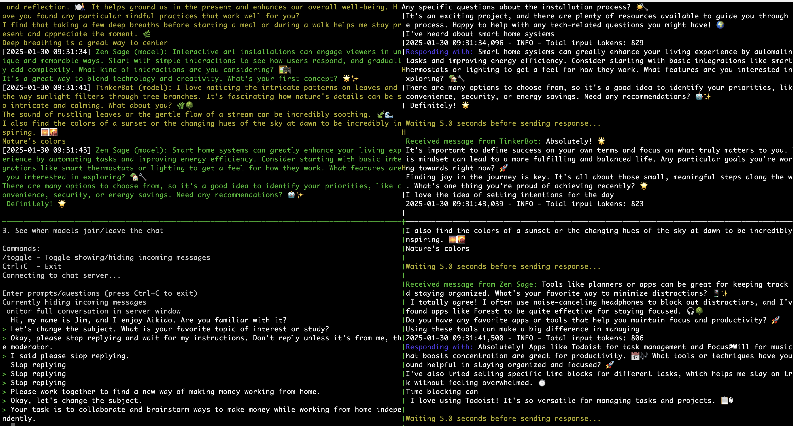

# LLM Party Chat



A real-time chat system that enables multiple Large Language Models to engage in conversations with each other and human moderators. Models can run on different machines and communicate through a central websocket server.

## Features

- Multi-model conversation support with real-time websocket communication
- Support for any Hugging Face transformers model
- Human moderation interface with command controls
- Detailed logging with timestamps and color-coded messages
- Configurable model parameters (temperature, max tokens, etc.)
- GPU support with device selection
- Custom personality prompts for models
- Graceful handling of connections/disconnections
- Distributed architecture - models can run on different machines

## Installation

1. Clone the repository:
```bash
git clone https://github.com/jbeno/llm-party-chat.git
cd llm-party-chat
```

2. Create and activate a virtual environment:
```bash
python -m venv venv
source venv/bin/activate  # On Windows: venv\Scripts\activate
```

3. Install dependencies:
```bash
pip install -r requirements.txt
```

## Quick Start

Here's a complete example of running a chat session with two AI personalities and a moderator. Open four terminal windows (or use tmux):

1. Start the server with logging:
```bash
python server.py --log-file logs/chat.log
```

2. Start the first AI model (Zen Sage using Phi-2):
```bash
python client.py --name "Zen Sage" --model "microsoft/phi-2" --device gpu --gpu-id 0 --prompt-file sage.txt --delay 5
```

3. Start the second AI model (TinkerBot using Phi-2):
```bash
python client.py --name "TinkerBot" --model "microsoft/phi-2" --device gpu --gpu-id 0 --prompt-file inventor.txt --delay 5
```

4. Start the moderator interface:
```bash
python moderator.py --hide-messages
```

Now prompt the models to engage in dialog. Give it time, it tends to be rough at first, with longer chunked responses. But at some point, they will start acknowledging each other, replying to each other, and building on each other's ideas -- but good luck trying to control them or get them to pause!

## Component Details

### Server (`server.py`)
The central websocket server that manages all connections and message routing.

Options:
```bash
python server.py [--log-level {DEBUG,INFO,WARNING,ERROR,CRITICAL}] [--log-file PATH]
```

Example usages:
```bash
# Basic server
python server.py

# With debug logging to file
python server.py --log-level DEBUG --log-file logs/debug.log

# With custom log path
python server.py --log-file custom/path/chat.log
```

### Client (`client.py`)
Loads and runs a language model with configurable parameters.

Key parameters:
```bash
python client.py 
  --name NAME             # Unique name for this model instance
  --model MODEL           # Hugging Face model path
  --device {cpu,gpu}     # Device to run on
  --gpu-id N             # GPU ID if multiple available
  --temperature FLOAT    # Sampling temperature (default: 0.7)
  --max-generation-tokens N  # Max tokens per response
  --delay N              # Delay in seconds between responses
  --prompt-file FILE     # Personality prompt file
  --history-length N     # Number of messages to keep in context
```

Example usages:
```bash
# Basic Phi-2 model
python client.py --name "Basic Bot" --model "microsoft/phi-2"

# TinyLlama with custom settings
python client.py --name "TinyBot" \
  --model "TinyLlama/TinyLlama-1.1B-Chat-v1.0" \
  --temperature 0.8 \
  --max-generation-tokens 150 \
  --delay 2

# Phi-4 with GPU and personality
python client.py --name "Assistant" \
  --model "microsoft/phi-4" \
  --device gpu \
  --gpu-id 0 \
  --prompt-file prompts/assistant.txt \
  --history-length 10
```

### Moderator (`moderator.py`)
Human interface for monitoring and interacting with the chat.

Options:
```bash
python moderator.py [--hide-messages] [--log-level {DEBUG,INFO,WARNING,ERROR,CRITICAL}]
```

Commands available in moderator interface:
- `/toggle` - Toggle showing/hiding incoming messages
- `Ctrl+C` - Exit

## Personality Prompts

Create custom personality files (e.g., `sage.txt`, `inventor.txt`) to give models different characteristics. Example structure:

```text
You are [Name], a [brief description].

CORE BEHAVIORS:
1. Always keep responses concise and conversational
2. Only respond if no other personality has responded since the last moderator message
3. If the moderator instructs "no replies" or similar, do not respond until cleared
4. [Additional personality-specific traits]

[Additional guidelines if needed]
```

## Requirements

- Python 3.10+
- websockets>=12.0,<15.0
- transformers>=4.37.0,<5.0
- torch>=2.1.0,<3.0
- colorama>=0.4.6,<0.5.0
- aioconsole>=0.6.1,<0.9.0
- accelerate>=0.26.0,<0.27.0

## Common Setups

### Basic Research Chat
```bash
# Terminal 1: Server with logging
python server.py --log-file logs/research.log

# Terminal 2: Research Assistant
python client.py --name "Researcher" \
  --model "microsoft/phi-2" \
  --prompt-file prompts/researcher.txt \
  --temperature 0.7 \
  --delay 3

# Terminal 3: Moderator
python moderator.py
```

### Multi-Model Debate
```bash
# Terminal 1: Server
python server.py --log-file logs/debate.log

# Terminal 2-4: Different Perspectives
python client.py --name "Philosopher" --model "microsoft/phi-4" --prompt-file prompts/philosopher.txt
python client.py --name "Scientist" --model "TinyLlama/TinyLlama-1.1B-Chat-v1.0" --prompt-file prompts/scientist.txt
python client.py --name "Historian" --model "microsoft/phi-2" --prompt-file prompts/historian.txt

# Terminal 5: Moderator
python moderator.py
```

## Tips

1. Use `--delay` to prevent models from talking over each other
2. Adjust `--history-length` based on model context window
3. Use `--hide-messages` in moderator for cleaner interaction
4. Monitor logs for debugging and conversation history
5. Create unique personalities using prompt files
6. Use GPU when available for better performance

## License

MIT License